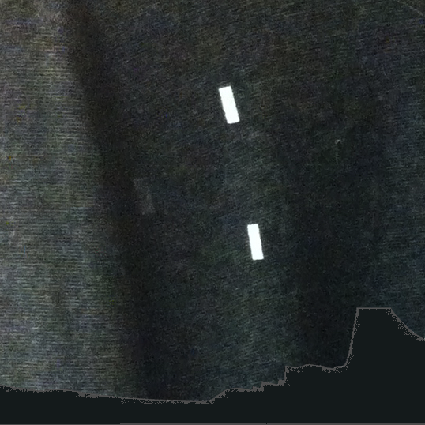

Prevailing trends in biosensing promote individualistic, algorithmically defined emotions, wellness, and self-improvement. My stance is that this alone is far too limiting. Designs should embrace and explore a multiplicity of values, experiences, and interpretations. Interpretation, moreover, is inextricable from representation, and materiality shapes information representation. So, drawing from an alternative lens that foregrounds contextually situated interpretation, I design biosensing representations with properties unlike those of typical data visualizations or screens by leveraging the physical properties of dynamic materials, such as the slow, non-light-emitting color changes of thermochromic fabrics. Embedding these displays in clothing brings in associations around personal style, self-presentation, and the body, which may further shift interpretations.

This paper explores the social meaning of clothing-based displays of biosignals. How do friends make sense of their own and each other's skin conductance display in the context of a conversation? We developed Hint, a dynamic thermochromic t-shirt with ambiguous patterns that change color when its wearer's skin conductance increases, an indication of sudden arousal. We investigated how pairs of friends, each wearing the shirt, conversed and interpreted the display. Participants shared a broad range of interpretations, and emotions such as joy and embarrassment were associated with an increase in skin conductance. Additionally, participants expressed desires for their skin conductance displays to help validate their feelings and show emotional engagement with others. We explore ambiguity in the context of clothing-based information displays and discuss how skin conductance display became part of social performance in our study. From there, we suggest framing biosignals as social cues along with facial expression, gestures, etc., and begin to question what design territories this might uncover.

## Publications

Noura Howell. 2016. Representation & interpretation of Biosensing. *Designing Interactive Systems (DIS’16)*. 
[\[PDF\]](assets/DIS2016_DC_Representation_Interpretation_Biosensing.pdf)

Noura Howell, Laura Devendorf, Rundong (Kevin) Tian, Tomás Vega Galvez, Nan-Wei Gong, Ivan Poupyrev, Eric Paulos, Kimiko Ryokai. 2016. Biosignals as social cues: Ambiguity and emotional interpretation in social displays of skin conductance. *Designing Interactive Systems (DIS’16)*. 
[\[PDF\]](assets/DIS2016_Biosignals_as_Social_Cues.pdf)
