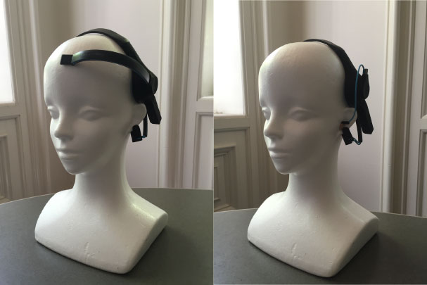

Brain-computer interfaces (BCIs) enable the control of a
computer without muscular action. BCIs based on electroencephalography (EEG) have improved dramatically over the past five years, but their head-worn form factor and awkward visibility have challenged their wider adoption. 

In these projects, we use a home-rigged, single-electrode EEG placed inside the ear canal (above) to investigate how signals from the ear could be used for "mental gestures," and for passthought-style authentication (see our [past work on passthoughts](http://people.ischool.berkeley.edu/~chuang/passthoughts/)).  Eventually, this research could provide hands-free interaction, authentication, and a seamless and comfortable user experience, all in the form-factor of a typical earbud.

## Publications

Max T. Curran, Jong-Kai Yang, Nick Merrill, John Chuang. 2016. *IEEE Engineering in
Medicine and Biology Society (EMBC'16)*.
[\[PDF\]](assets/EMBC2016.pdf)

Nick Merrill, Max T. Curran, Jong-Kai Yang, John Chuang. 2016. Classifying Mental Gestures with In-Ear EEG. *13th International Conference on Wearable and Implantable Body Sensor Networks (BSN '16)*. [\[PDF\]](assets/BSN2016.pdf)
