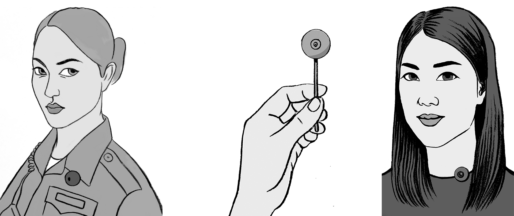
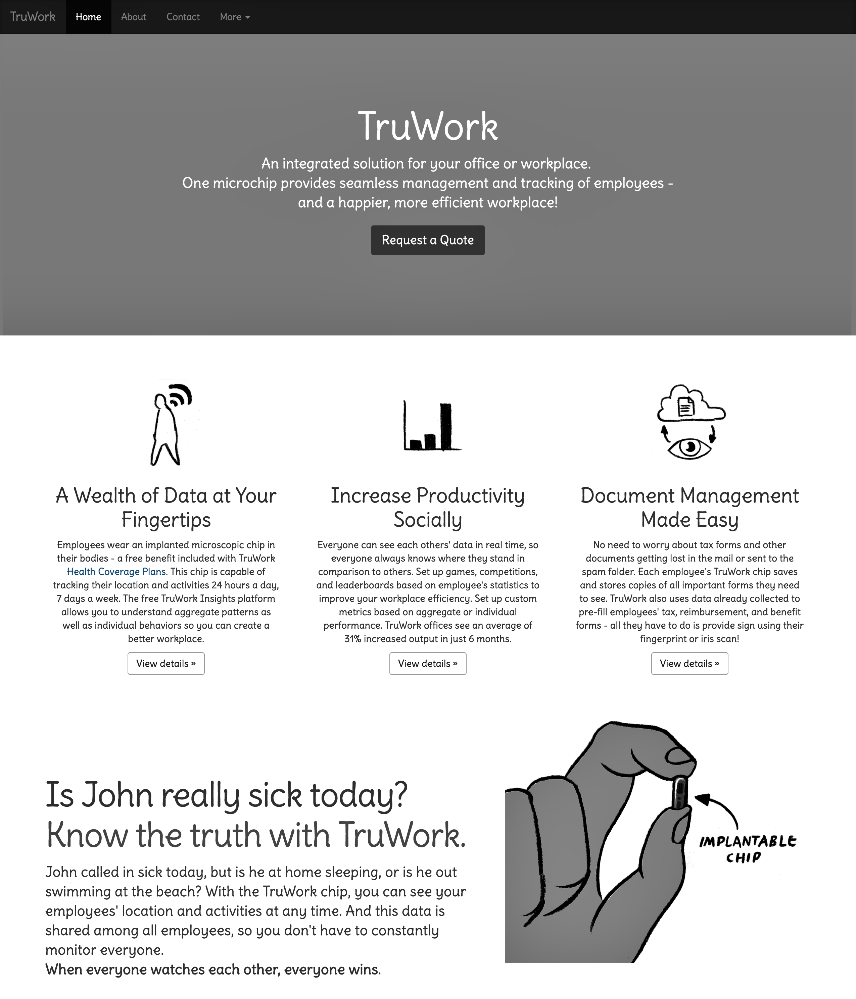

This project explores how science fiction and design fiction can be used to explore possible futures and elicit values surrounding emerging sensing technologies. In particular, we focus on values and issues related to privacy. 

*Images by Ellen Van Wyk*

## Design Fictions
Inspired by the novel *The Circle*, we created a set of design fictions. Design fictions are a mix between science fact, science fiction, and design. These conceptual designs suggest speculative or alternate future worlds that imagine what the future might be like in order to help generate discussions about futures we want to see (and those that we want to avoid). 

By creating design proposals that explore connections between the novel’s imagined world and our present (and future) realities, we are able to explore, expand, and articulate a range of social, technical, and legal configurations of the future. We contribute a set of design fiction proposals, a case study of a design project that use design fiction to engage issues of privacy and surveillance, and we provide a need approach to creating design fiction - by using science fiction texts as a starting point for design. 

## Publications
Richmond Y. Wong, Ellen Van Wyk and James Pierce. (2017). Real-Fictional Entanglements: Using Science Fiction and Design Fiction to Interrogate Sensing Technologies. *In Proceedings of the ACM Conference on Designing Interactive Systems (DIS '17)*.  [\[PDF\]](assets/Wong_Van_Wyk_Pierce_DIS2017_Real-Fictional_Entanglements.pdf)

## Additional Images

*Images by Ellen Van Wyk*

