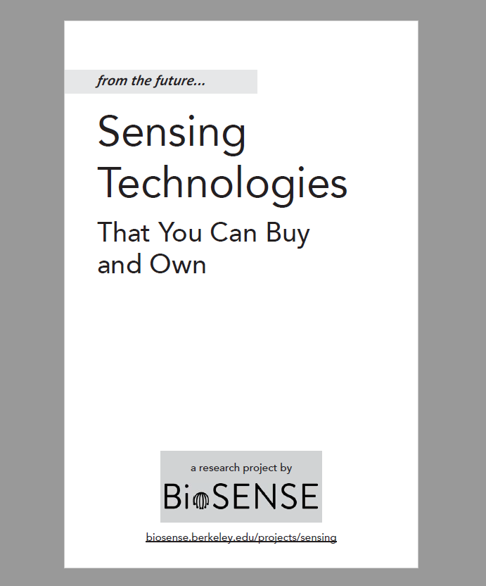

# From the Future...Sensing Technologies That You Can Buy and Own
If you recieved a copy of our design booklet and would like to provide feedback, please fill out our [survey and feedback form](https://berkeley.qualtrics.com/jfe/form/SV_39mxSvlH4gQbImp)!

You can also read research publications related to this booklet on our [project page](../sci-fi-design-fiction/)

## About the Project
We created a booklet of imagined design concepts, or design fictions, that revolve around possible future technology products. Design fictions are a mix between science fact, science fiction, and design. These designs use fictional products to imagine what the future might be like in order to help generate discussions about future we want to see (and those that we want to avoid). The designs in this booklet are inspired by Dave Eggers’ 2013 novel _The Circle_, current events, and trends in technology research and development.

We aren't interested in producing these conceptual designs into products - instead, we're interested in how people understand and perceive these design ideas. If you recieved a copy of our design booklet, we welcome your opinions and feedback by filling out and returning the postcard included in the booklet, or by filling out our [online survey](https://berkeley.qualtrics.com/jfe/form/SV_39mxSvlH4gQbImp). 

You can also download an [information sheet](http://people.ischool.berkeley.edu/~richmond/forms/postcards-consent.pdf) with more details about our research procedures. 
